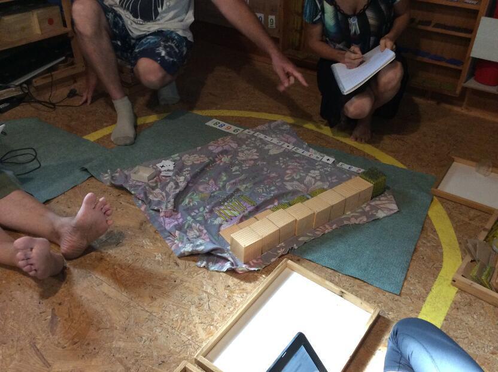
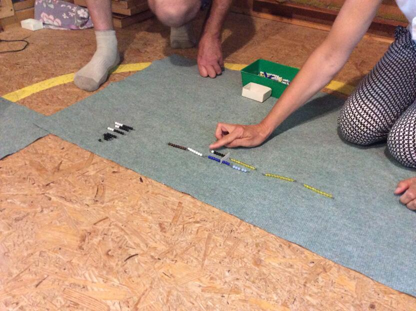
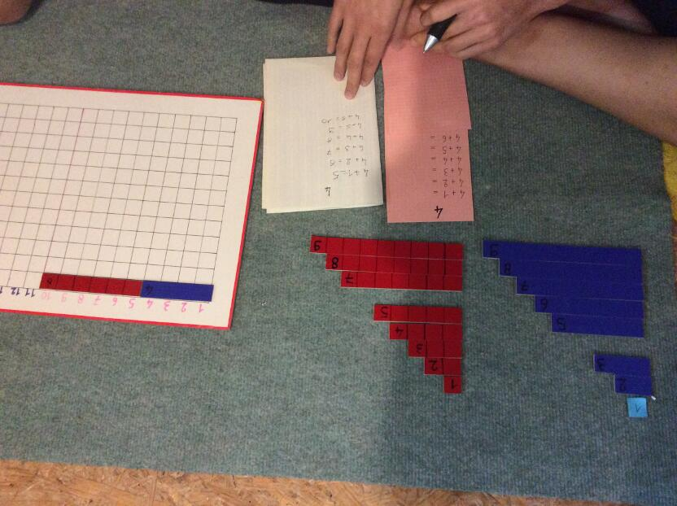
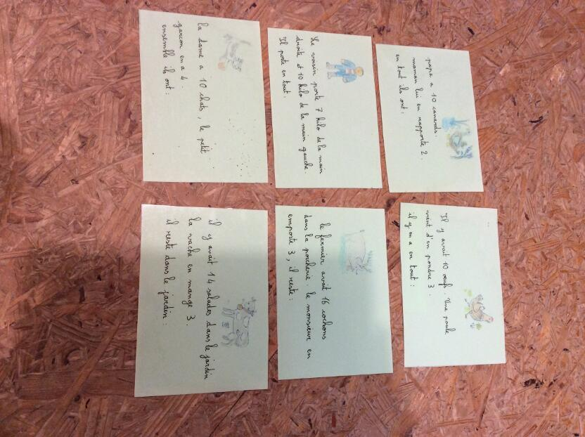
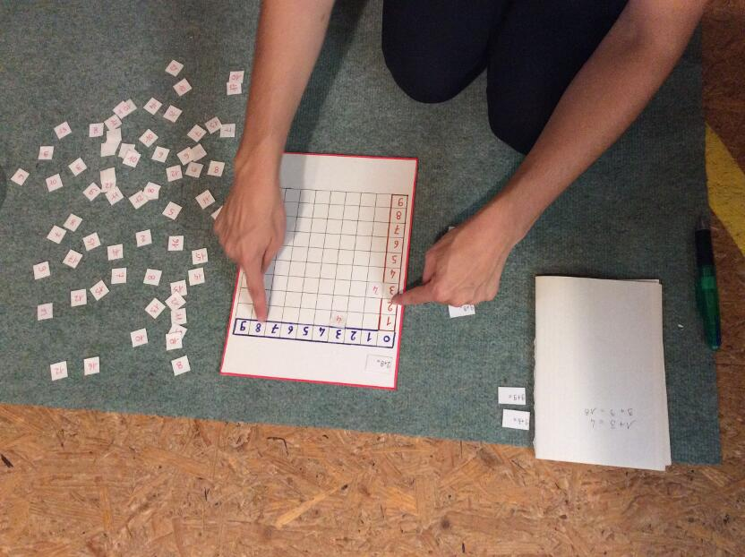

Présentation de l'addition (fin GS, CP)
=======================================

Matériel
--------

banque de perles,  boite à cartes-nombres : 1 à 9 vert, 10 à 90 bleu 100 à 900 rouge, tableau à cartes classe

Progression
-----------

-   gestion des priorités : avant les tables de Séguin

-   préparation leçon 3 temps des chiffres (1 10 100 1000), à mille, il y a combien de zéros?

-   addition de 3 nb à 4 ch = &lt;10 000

-   présentation : construction du nb (~GS, fin) commencer avec qqes unités "je vais te mettre qq perles tu vas compter" (ex on commence avec 3,8,puis 12) &gt; 10 se pose une situation pb : on ne peut mettre qu'une carte unité, on ne peut pas utiliser une carte dizaine si on a des perles unités solution il faut aller à la banque et échanger : pour cela on pose sur le comptoir et on recompte avec le banquier ensuite avec des dizaines etc.

Construction du nombre
----------------------

tu vas me construire ce nombre (donné par l'adulte, avec 4 étiquettes séparées une pour les unités, une dizaine, une centaine un millier) plateau + banque : on commence toujours par les unités

- Magie du nombre on superpose les 4 étiquettes et on les fait glisser l'une sur l'autre avec un mouvement de doigt pour faire apparaître le nombre

- Le balluchon de l'addition :  on réunit 3 grands nombres dans un balluchon, on constate que c'est lourd.

- Finalisation on transcrit le nombre avec les grandes étiquettes un dix, deux dix,… huit dix ... pas nécessaire d’avoir fait les tables de Séguin
regarde : sur ton plateau il y avait ça on a ajouté celui-là et celui -là quand on ajoute on met le signe + on arrive à l'écriture : 3233 + 4312 + 2143 = 9688
S'il manque une unité d'un rang on ne corrige pas

- Écriture : si l'addition est exacte on le met sur un petit carnet

Complexification de l'exercice
------------------------------

-Je vais te mettre quelques perles, avec l'aide des symboles (étiquettes), on va écrire combien il y a de perles D'abord 8, 6, Puis plus de 10 : 14 unités. “là tu ne peux pas” . On va voir le banquier, on pose devant la banque puis 17 barres de 10 il faut faire l'échange 10x10 contre 100
-Puis 800
-Puis 14 x 100, 10 cent ça fait un mille, magie du nombre : 1400

Addition dynamique
------------------

3 enfants construction des nombres 2354, 2567, 1773 avec la banque on vérifie : il en est demandé combien ici... (vérification de l'erreur) faites la magie du nombre de vos plateaux
-   un enfant reste avec les 3 plateaux
-   balluchon de l'addition : c'est lourd !
-   tu l'ouvres et tu écris combien il y a : échanges avec la banque : unités, dizaines, centaines... 2354+2567+1773 = 6694 Tu me lis la belle phrase mathématique que tu viens d'écrire

Le petit serpent
================

présentation du matériel
------------------------

(barrettes de perles toutes couleurs) serpent multicolore (en pyramide)

Construction du serpent
-----------------------

Tu mets une barrette, moi je mettrai l'autre 5-5 6-4 7-3 2-8 =l'adulte égalise à 10 ce que pose l'enfant

Formation du serpent doré
-------------------------

on compte les barettes : qd ça fait 10, on remplace les barrettes par une de 10, qui est dorée aide : un petit carton avec encoche pour compter et poser entre les perles, le cavalier

Vérification
------------

on va regarder si le serpent à la même longueur. Mettre les barrettes dorées en position Maintenant on va regarder si on ne s'est pas trompé en comptant les perles : On arrive à 9+1=10, 8+2=10...

Serpent niveau 2 - serpent positif avec change
==============================================

présentation des barrettes complément à 10, qui sont noires et blanches (cf photo)
----------------------------------------------------------------------------------

construction du serpent seulement par l'enfant, qui aligne les barettes de perles: " Fais un serpent multicolore"
-----------------------------------------------------------------------------------------------------------------

formation du serpent doré
-------------------------

il compte avec l'aide du cavalier jusqu'à ce que ça fasse 10, alors il peut échanger MAIS il restera des perles, ça ne tombe pas "juste" à 10 donc il faudra mettre une barrette pour compléter. Pour barrette de complément on utilise les barrettes compléments à 10

"alors maintenant vas-y compte !" 3-9... arrivé à 10 on laisse le cavalier à 10 et on place une barre de 10 et le change : les 2 qui manquent et on enlève 9 et 3

vérification
------------

on va regarder si le serpent à la même longueur. mettre les barrettes dorées en position verticale Maintenant on va regarder si on ne s'est pas trompé en comptant les perles : On aligne les perles de l'ancien serpent sur les dizaines du nouveau On arrive à 9 contre 10, mais comme on n'a pas de 1 : on doit faire un échange avec le banquier Maintenant tu peux en faire plein pour t’entraîner

Passage aux chiffres : les timbres
==================================

-   NB pour les adultes : pour choisir les nb, il faut que l'enfant en parallèle ai vu la table d'addition jusqu'au nb max (ici 5). on ne donne rien de supérieur, on laisse l'e s’entraîner, on lui en donne plein par jour.

-   en parallèle aussi la table des points est présentée (cf plus loin)

-   Les grandes additions, par le fait qu'elles donnent des grands résultats des additions à (6000 !!) sont extrêmement valorisantes. On demande à l'enfant de grandir, et l'intérêt de ces additions est de lui faire du bien au moral. Ils sont très occupés, bcp de méthodo, et on donne des exercices qui les appliquent.

-   Progression globale en numération : addition puis assez rapidement soustraction

-   rappel code couleur:

    -   vert : unité

    -   rouge : dizaine

    -   bleu : centaines

    -   vert : unité de mille,

    -   etc.

-   Lignes hiérarchiques, de couleur correspondant aux unités, dizaines, centaines, milliers. À préparer à l'avance.

-   Notes pratiques il faut 4 pots, avec les couleurs. 100 de chaque : 1 10 100 1000, environ 2cm x2cm prendre des plaques de carton très épais, enduits d'une feuille de Vénilia ou autre de la bonne couleur et on écrit

Présentation : leçon en 3 temps
-------------------------------

Un (perle) et 1 (chiffre) c'est la même chose dix et dix cent et cent mille et mille...

à mille il y a combien de zéros... à dix ? , à cent ? ...

Écriture du chiffre en chiffres (et plus en perles)
---------------------------------------------------

Je te mets un nombre ici et tu vas me l'écrire avec les timbres On commence toujours par les plus petits

 

Addition de grands nombres (4 chiffres)
---------------------------------------

-   Mettre une barre rouge genre règle, pour délimiter l'espace puis en colonne un autre grand nombre. même consigne.

-   On construit deux nombres donnés par des jeux de 4 étiquettes, séparés par une barre puis on mets le + et donc on les rassemble.

-   enlever la barre, remonter tous les timbres : "on fait le petit train des nombres" et ensuite l'enfant reconstitue le nombre avec les étiquettes

-   "magie des nombres"

Constitue l'addition : 2546 + 3252 = 5798

sur la gauche du tapis il y a les 2 gd nombres, les signes + et + et le résultat. L'enfant n'a pas additionné mais bien compté !

Passage à l'écrit
-----------------

### sans recours à l'échange

-   Nombre donné sur une feuille de papier avec des lignes verticales marquant les rangs

-   Même protocole : deux nombres construits avec les timbres, séparés par une barre puis on écrit le + on enlève la barre et on rassemble avec le petit train et on écrit le résultat

-   Faire lire la sphrase mathématique

### Addition avec échanges

-   Dans un second temps, construis-moi ce nombre (donné avec 4 étiquettes) ex 3465

-   Maintenant on va ajouter celui-là + 2678 tu peux me le construire dessous

-   Vas-y fais le petit train de l'addition (on rassemble rang par rang)

-   Avec la boîte des symboles, je te laisse écrire le résultat, tu sais comment faire ...

-   Regarde je vais t'aider : un, deux... dix tu as dix unités qu'est-ce que tu peux faire?

-   échange : dix unités contre une dizaine que l'on place avec les dizaines : on marque cette retenue en la plaçant au dessus (la retenue n'est pas collée aux autre mais reste bien séparée, dans l'alignement.)

principe à généraliser : on échange dix petits contre un plus grand (sauf que maintenant, tous les timbres ont le même format)

-   Magie du nombre

-   Faire lire la phrase : tu peux me lire l'addition que tu viens de faire ?

sur la gauche du tapis, l'addition est posée en colonne. cf photo

### passage à l'écrit

Les deux nombres à construire et additionner sont donnés sur un papier ligné simultanément sur la gauche du tapis, l'addition est posée en colonne.

Même protocole (train de l'addition-échanges) écriture du nombre en direct sur le papier sans passer par les étiquettes l'enfant ne connaît pas encore les tables d'addition suppose beaucoup de méthode : bien ranger après chaque change pour ne pas se mélanger

### passage au calcul sans manip, abstraction

-   proposer une grande addition sur papier "est-ce que tu sais, dans ta tête combien ça fait 5+2 ?" etc.

-   vérification avec le matériel (timbres) : même manip que précédemment

Les tables d'addition
=====================

Matériel : Le grand tableau d'addition, les barrettes rouges et bleues, les tables d'addition
---------------------------------------------------------------------------------------------

On range les barrettes en pyramide fer à gauche, rouges d'un côté, bleues de l'autre

présentation
------------

Aujourd'hui on fait la 4 (on ne commence pas par la plus petite, ni la +grande) le code couleur de l'addition c'est rouge : le matériel d'addition est rouge (fiches...) l'enfant a son cahier, sur lequel il s'exerce potu tous les ex On peut faire des carnets préimprimés (cf. <http://crapouillot-montessori.blogspot.fr/> )

entraînement
------------

Sur le tableau on aligne 4 (barrette bleue) à gauche + 1 (rouge) et on lit la colonne : ça fait 5

Écriture
--------

l'e écrit sur son cahier 4 + 1 = 5 idem 4 +2 =... etc.

vérification
------------

On vérifie grâce à une table de correction (plastifiée, pour toutes les tables, on met des caches pour ne pas se tromper de colonne et ligne)

Les tables des points
=====================

objectif : passage au papier et à l'abstraction, attention car la pratique demande beaucoup de méthodologie, souvent les e se perdent en route. Il faut bien connaître les tables d'addition, qu'elles soient automatisées, sinon surcharge avec toutes les additions intermédiaires. Une feuille par calcul

cf scan de la feuille

exemple 1 : 4632 &gt; on fait des petits points dans chaque rang 2123 &gt; on rajoute des petits points à la suite, sur la même ligne. On compte les points ds chaque colonne, et on peut vérifier le résultat. toujours même principe, d'abord sans retenue puis on va complexifier

exemple 2 : 6755 on va rajouter 8579 T'as plus de place, tu vas dessous : tu vas de droite à gauche et après tu vas dessous Pour les unités : il y en a trop : avec le crayon vert je barre dix et je prends le crayon bleu et je rajoute une dizaine avec une croix (et non un point : différencie la retenue) idem : dix centaines  →  un mille ; dix mille → un dix-mille

Dans un deuxième temps on écrit les nombres en bas la retenue des unités peut apparaître dans la colonne des dizaines mais en vert (couleur des unités, comme dans un tableau de numération, le un de la retenue vert vaut dix unités)

Table des doigts renseignée
===========================

autre outil de mémorisation des tables d'addition - on parcourt la table avec deux doigts suivant une ligne et une colonne - on note les résultats sur le cahier et on vérifie avec la fiche de contrôle cf photo même principe que table d'addition

Les combinaisons d'addition
===========================

Entraînement
------------

l'e tire 10 cartes au hasard. Le top est d'avoir une boite au nom de l'enfant pour ranger s'il n'a pas fini en une fois (ce qui n'arrive pas) dans le tableau, il va résoudre avec les doigts et note les résultats sur son cahier \#\# vérification à la fin avec la table de contrôle. Ainsi l'enfant relit deux fois le résultat une fois sur son cahier, une fois sur la table.

Table des doigts non renseignée
===============================

la même mais en vide, et étiquettes des nombres, carte de la table d'addition et cahier de l'e.

Remplissage d'une table d'addition
----------------------------------

l'a choisit une table. pour l'e double tache : -remplir le table avec les étiquettes et -écrire sur le cahier. Pour éviter qu'il remplisse mécaniquement, en ayant vu que c'est une suite.

l'idéal serait de garder la table/e, afin qu'il la complète mais comment faire tenir les petites étiquettes ? prévoir le matériel en double ou triple car la table sera construite sur 2 ou 3 semaines on peut faire une petite boite pour ranger les étiquettes nombres, genre boite en carton cloisonnée. Celà permet de gagner du temps en cherchant les étiquettes.

Combinaisons d'addition
-----------------------

consigne :"Tu prends \[entre 6 et 12\] additions et tu les fais" idem : faires les additions et écrire. Vérification avec la table complète.

Combinaisons d'addition à trous, "combinaisons spéciales"
---------------------------------------------------------

? + 3 = ? 7+ ? = 12 17= ? + ? la présentation des additions varie, et les difficultés ne sont pas les mêmes.

Petits problèmes d'application
==============================

Sur des cartes, un problème est posée dans un contexte et il faut retirer les informations et pratiquer l'opération sous-entendue. Exemple : "A droite il y a 8 lapins, devant il a quatre lapins. Combien il y a de lapins en tout ? "

Table des doigts
================

Cette table en forme de triangle est un autre exercice, elle montre la commutativité de l'addition. Suivre avec les doigts en partant des deux chiffres, vers le droite. Lorsqu'on est au bout soit on rejoint le milieu par la diagonale (pair), soit arrivés au bout on descend (impair) cf photo En gros le principe c'est de faire la moyenne mathématique : A+B = (2A+2B)/2

Le boulier (&gt;6ans)
=====================

-   petit boulier 1,10,100, 1000

-   grand jusqu'à 1 000 000

-   Bouliers à 10 boules sur chaque rang. Les boules sont des perles en buis, les lignes en fil de fer, le cadre en bois collé cloué.

-   Travail de numération : énumérer en faisant glisser les perles: matérialise le passage au rang supérieur, groupement-échange.

-   la boule "retenue" est d'abord placée un peu décalée, puis ajoutée au groupe.

-   Faire des opérations au boulier 1 648 527 + 5 875 988 = 8 534 515 La différence de plan, vertical et lecture avec 1000 en bas et unités en haut peut perturber les enfants s'ils travaillent en même temps sur papier.

