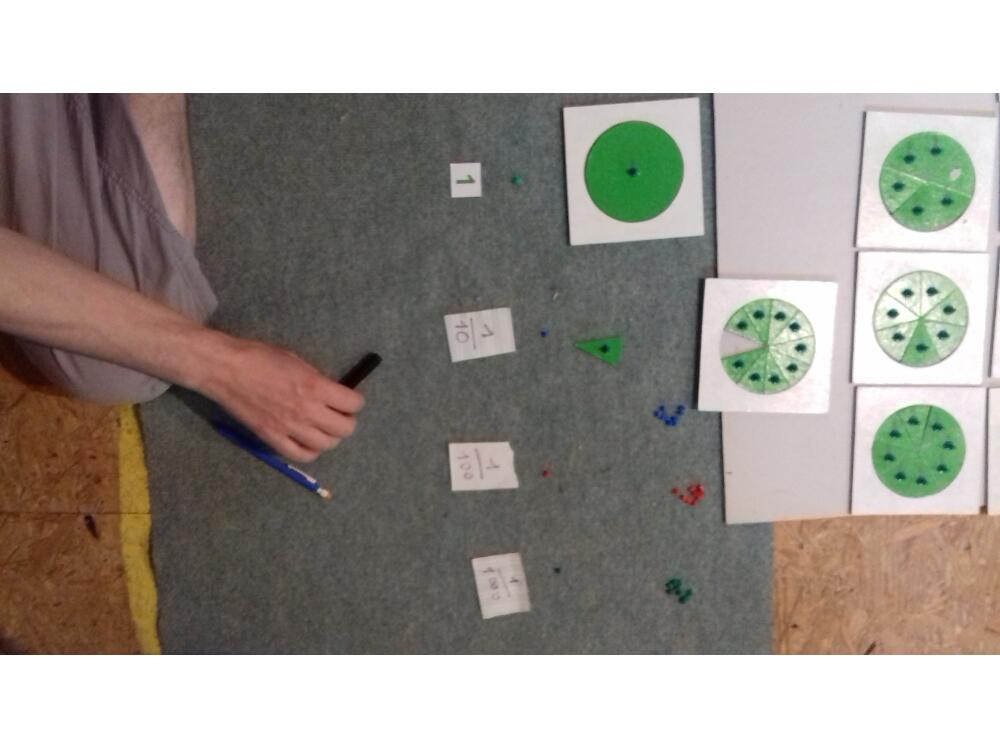

<!--

---
title: Addition 5-8 ans
description: Cours Montessori fractions 5-8 ans
image_url: 
licence: CC-BY-SA
---

-->
CC-BY-SA Mélanie Lacayrouze et Georges Madar -2017

FRACTIONS
=========

Première approche
=================

On prend une pomme Je la partage en deux moitiés ça c'est une moitié, ça aussi, ça fait deux moitiés je recommence, ça fait un quart il y a quatre quarts dans une pomme Reconstituer la pomme avec les 4 morceaux, les poser côte à côte.

Les disques des fractions
=========================

Matériel
--------

cf photo disques des fractions (dont le diamètre est 10) étiquettes nombres, etiquettes barre noire.

Présentation : leçon en 3 temps
-------------------------------

-   Présentation du disque plein avec une perle Ça \[le disque\] c'est 1, c'est la même chose que ça \[la perle\]

-   Présentation du disque coupé en deux Ça c'est la famille des demis et moi je vais prendre un demi : on note 1, barre noire en dessous, 2. 

-   idem disque ocupé en 3 : la famille des tiers, il y en a 3 : 

-   idem disque coupé en 4 : la famille des quarts, il y en a 4. 

-   5, 6 7 ... jusqu'à 10, un dixième.

Dans la famille des huitièmes j'en voudrais 2 : deux huitièmes 

On partage une feuille en 8 : chaque part fait un huitième

Je prends une barre rouge et bleue partagée en 7, la petite c'est un septième

Bande de papier...

Il existe un matériel Montessori avec des triangles et des rectangles pour présenter les fractions

Retour avec les disques
-----------------------

L'a demande  ,  en rassemblant les secteurs on construit l’écriture :    

De même , l'a demande trois septième et deux septièmes : 

 

On met le dénominateur ( celui qui donne le nom) en bas d'abord : "le nom de la famille" avant le numérateur idem six neuvièmes moins quatre neuvièmes

Puis :

 

Approche du Théorème de Pythagore par puzzle
============================================

Matériel
--------

cf photo : plateau dédié : Puzzle du théorème de Pythagore

Présentation
------------

-   dans la section des grands carrés, on ote le grand carré rouge. tu vas mettre le jaune et le vert en petits carrés dans le rouge

-   maintenant on ôte le grand carré vert et grandd carré jaune tu vas mettre les petits carrés rouges dans le jaune et le vert. cf photo

-   on prend le triangle (blanc) : ce triangle tu vois le gd cote il s'appelle l'hypoténuse. tu vois, le carré qui est collé à l'hypoténuse il est égal au deux carrés qui sont collés aux deux autres cotes

-   conclusion : Le carré de l'hypoténuse et égal à la somme des carré des côtés opposés

Les équivalences de fractions
=============================

Matériel
--------

Disques partagés , papier, feutre, cahier de l'élève

Présentation de base
--------------------

Dans un disque divisé en tiers, on enlève un tiers et on recherche ce qui pourrait convenir l'e prend successivement tous les autres disques fractionnés et essaye de completer On obtient : (avec les contreparties en secteurs de disques) ex : 

Puis  , remis dans l'ordre par l'adulte éventuellement, 

Suite
-----

-   l'enfant va fabriquer sa propre leçon en dessinant les contours des associations de secteurs et en écrivant les égalités de fractions correspondantes

-   il peut vérifier en posant les parts de disque correspondantes

Il dessine aussi les disques divisés en tiers, quarts... en écrivant dans chaque secteur la fraction correspondante poru cela poser sur une grande fueille blanche, et dessiner le contoru au crayon il garde une trace dans osn cahier (recopier les égalités et équivalences)

On obtient avec le demi : 

Pour ces exercices on peut encourager l'enfant à avoir un environnement organisé, vu le nb de matériel nécessaire et l'espace nécessaire pour faire le contour, écrire...

Addition de fractions
=====================

On ne travaille que des fractions de même dénominateur, les changements de dénominateurs ne sont pas au programme avant le secondaire On peut introduire le vocabulaire : numérateur, dénominateur

Matériel
--------

Les disques partagés: : cercles fractions, papier + ciseaux.

Présentation
------------

-   constituer une banque de fractions l'e prends un cercle dont i lfait le contour. il fait des fractions dans ce cercle: ex les tiers, avec deux cercles il en a 6.

-   manipuler

-   additionner : je veux  , ça fait 

On calcule  - énoncer la règle d'addition

Quand on a des fractions de la même famille, pour les ajouter on ajoute les numérateurs

On pourrait "convertir" les 7/3 pour s'apercevoir que ça fait 2 + 1/3. L'idée étant de ne pas créer dans la représentations de l'e qu'une fraction ne peux pas être &gt; 1

Décompositions de l'unité
=========================

Materiel
--------

le même

Présentation
------------

On demande à l'e tout ce qui est égal à 

Suite : voir décimaux
=====================

