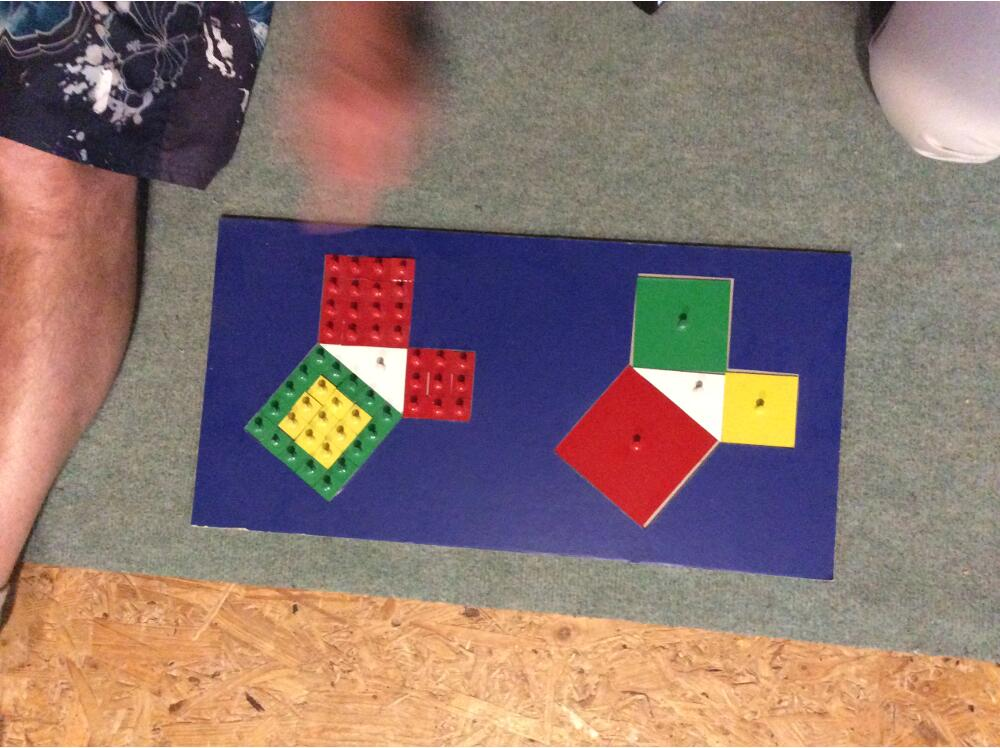
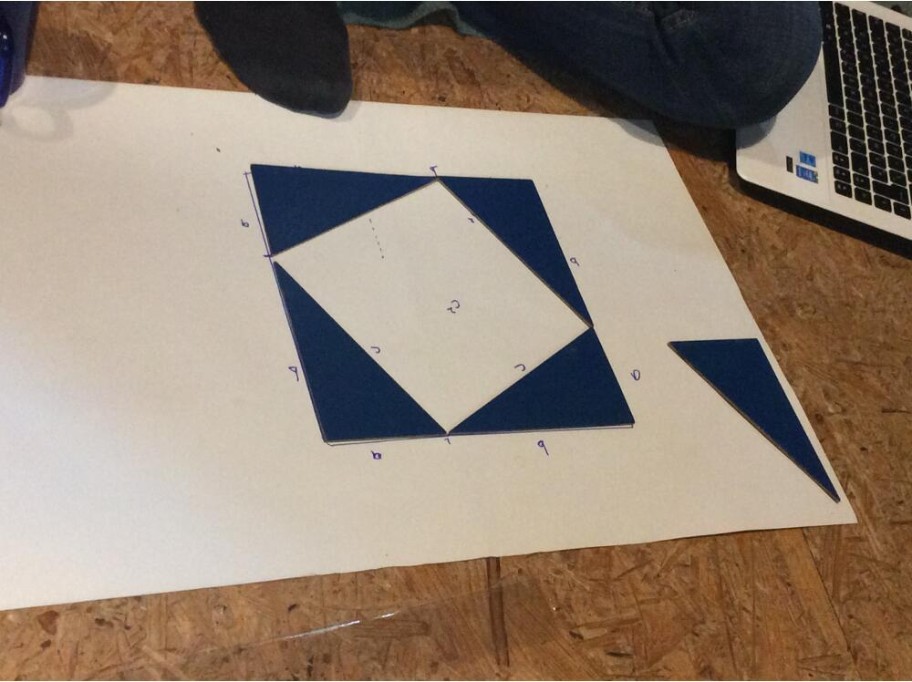
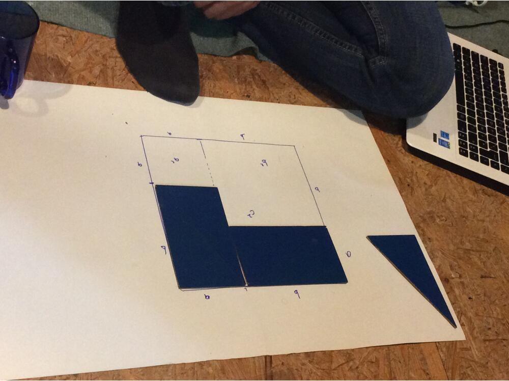

<!--

---
title: Addition 5-8 ans
description: Cours Montessori la mémorisation de la multiplication  5-8 ans
image_url: 
licence: CC-BY-SA
---

-->
CC-BY-SA Mélanie Lacayrouze et Georges Madar -2017

MÉMORISATION DES TABLES DE MULTIPLICATION
=========================================

L'enfant à pratiqué des multiplications avec les perles, suffisamment pour lui. Il a compris que multiplier c'est prendre un nombre un certain nombre de fois.

La table perforée de la multiplication
======================================

Matériel
--------

table perforée et perles cf photo, tables (sur fond jaune), cahier de l’élève.

Présentation
------------

Ex : la table de 4. On utilise non pas 4x1= mais 1x4=

- Présentation du matériel et du fonctionnement : à partir de la table choisie, l'e va mettre le 4 (multiplicande) sur la table.

- l'e va remplir, l'un après l'autre les colonnes avec les perles. Pour repérer le multiplicateur il utilise un jeton rouge. 1 x 4 : on place 4 perles unité (rouges) verticalement sur la table perforée 2 x 4 : on place une deuxième rangée de 4 perles unité à côté de la première ... 4 x 4 : "là : regarde, ça fait un carré" etc.

- L'e note les opérations au fur et à mesure sur son cahier

- Il vérifie ensuite à l'aide de la table de contrôle en lisant deux fois chaque opération : sur le cahier et sur la fiche de contrôle

La table des doigts renseignée pour construire une table
========================================================

cf photo

- Une fiche table comprend la table à compléter

- l'enfant écrit chaque opération sur son cahier en trouvant le résultat grâce à la table des doigts

- Il vérifie ensuite à l'aide de la table de contrôle en lisant deux fois chaque opération.

La table des doigts renseignée avec combinaisons
================================================

Matériel
--------

idem + boîte des combinaisons de multiplications

Présentation
------------

-   L'e tire quelques combinaisons et utilise la table des doigts pour trouver chaque résultat

-   Il note chaque opération sur son cahier

-   Il vérifie ensuite à l'aide de la table de contrôle en lisant deux fois chaque opération.

La table des doigts non renseignée avec tables de multiplication
================================================================

Matériel
--------

table des doigts non renseignée, tables ( 1x.=. 2x...= ), étiquettes résultat, cahier de l'e

Présentation
------------

-   L'e complète la table des doigts au fur et à mesure de la table qu'il travaille

-   Il note chaque opération sur son cahier

-   Il vérifie ensuite à l'aide de la table de contrôle en lisant deux fois chaque opération.

Même principe qu'avec les tables de l'addition et soustraction. L'e devrait la completer, en entraînement.

Entre la présentation 3 et la 4, on va faire:

Les tables de multiplication : la commutativité
===============================================

Matériel
--------

table des doigts simplifiée renseignée, tables ( 1x.=. 2x...= ), étiquettes résultat, cahier de l'e, fiche de contrôle simplifiée

Présentation
------------

-   L'e tire une table de multiplication. Il va utiliser la table simplifiée Utilisation de la table des doigts simplifiée renseignée : on part du nombre le plus petit horizontalement jusqu'en butée (sur la diagonale) puis verticalement jusqu'à la ligne du plus grand

-   Il note chaque opération sur son cahier

-   Il vérifie ensuite à l'aide de la table de contrôle simplifiée en lisant deux fois chaque opération.

Intérêt : On fait remarquer à l'enfant la commutativité de la multiplication et sa conséquence : on a beaucoup moins de résultats à mémoriser (cf. fiche simplifiée de vérification)

On peut faire une leçon avec les combinaisons à double entrée : 3x5 5x3, l'e va s'apercevoir que c'est le même résultat.

La table des doigts renseignée simplifiée avec combinaisons
===========================================================

Matériel
--------

idem + boîte des combinaisons de multiplications

Présentation
------------

-   L'e tire quelques combinaisons et utilise la table des doigts simplifiée pour trouver chaque résultat

-   Il note chaque opération sur son cahier

-   Il vérifie ensuite à l'aide de la table de contrôle simplifiée en lisant deux fois chaque opération.

L'e est invité à se servir de cette nouvelle table de contrôle, simplifiée pour toutes les vérifications.

Table des doigts non renseignée, les combinaisons et les chiffres
=================================================================

Lorsque l'e s'est bien entraîné, c’est un outil de vérification de la multiplication.

Matériel
--------

table des doigts simplifiée non renseignée, étiquettes opérations (combinaisons), étiquettes résultat, cahier de l'e, table de contrôle simplifiée

Présentation
------------

-   L'e tire quelques combinaisons

-   il complète la case correspondant à chacune à l'aide des étiquettes résultats

-   Il vérifie ensuite à l'aide de la table de contrôle simplifiée en lisant deux fois chaque opération.

Complexification
----------------

avec les étiquettes des combinaisons spéciales (à trous) ? x 4 = 12 5 x ? =20 ? x ? =30 etc...

Table de Pythagore de la multiplication, avec les perles
========================================================

Pour la mémorisation, l'e constitue avec les perles les collections correspondant à une fois 1, deux fois 1, ... dix fois 1 une fois deux,...

Matériel
--------

Table des opérations (papier), boite de perles

Présentation
------------

il note les résultats sur la table de Pythagore pré-remplie avec les opérations Une première présentation propose les collections de perles alignées verticalement comme sur la table de Pythagore (cf photo) dans l'ordre table de 1 puis de 2 en colonne.

Deuxième présentation (horizontale)
-----------------------------------

On place horizontalement : une fois 1, une fois deux, une fois 3... une fois 10 puis deux fois 1, deux fois 2 (Résultat identique)

Progression : Table de Pythagore simplifiée dispositif horizontal et vertical en parallèle
------------------------------------------------------------------------------------------

La table de Pythagore simplifiée ne comprend qu'une fois chaque résultat à mémoriser sous la diagonale principale (donc elle suppose implicitement la commutativité de la multiplication) l'e suit la feuille : 1x1, 2x1, 1x2 cf photo la table se créee par la première colonne et la première ligne simultanément, en alternant (un op de la colonne et une de la ligne)

Progression : Table de Pythagore simplifiée dispositif en angle
---------------------------------------------------------------

Autre table de Pythagore simplifiée ne comprenant qu'une fois chaque résultat à mémoriser au-dessus de la diagonale principale On fait chaque collection jusqu’à la diagonale : on atteint le carré suivant puis celles au-dessus, c-à-d  on commence tjs par le 1x, la première colonne, puis on continue jusqu’au carré sur la diagonale et on remonte

par ex. : après les 5 on arrive à une fois 6, deux fois 6,.... six fois 6, puis on remonte : six fois 5, six fois 4,....six fois 1

On voit apparaitre avec cette disposition les carrés.

Multiplication géométrique : rectangles découpés dans du papier quadrillé
=========================================================================

Matériel
--------

plein d'e, papier (idéalement quadrillages de 1cm, sinon gd carreaux), ciseaux, crayons

Construction
------------

faire des équipes de 1 ou 2, avec une couleur. La couleur correspond à un chiffre selon le code couleur Montessori. Dans du papier grand carreaux, on colorie au crayon et on découpe des bandes de largeur donnée (suivant le code couleur : 1 rouge, 2 vert...) puis on découpe des rectangles dans ces bandes de dimension : 1 x 1, 1 x 2, ...,1 x 9, 2 x 1, 2 x 2, ... , 9 x 9 Sur chaque rectangle, on note le nombre total de carreau (par ex 40). Au verso on note l’opération correspondant aux dimensions du rectangle, par ex : 5 x 8

L'e construit ainsi sa table de multiplication avec d'un côté le résultat et de l'autre les combinaisons

On a aussi amené le calcul d'aire, et l'équivalence des aires

COMPTER EN SAUTANT (PPCM)
=========================

Sur un tableau de nombres de 1 à 100, on colorie les case par saut de 2 ou 3 ou ...ou 9 (un seul nombre pas feuille). Puis, sur la même feuille, on refait le compter en sautant avec un autre nombre. On fait ainsi apparaître les multiples communs aux deux nombres.

Par exemple : les multiples de 8, les multiples de 5, on voit les multiples communs à 8 et à 5. Le premier de ces multiples communs l'appelle le "plus petit commun multiple" ou PPCM

PPCM de 8 et 5 : 40
